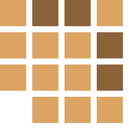
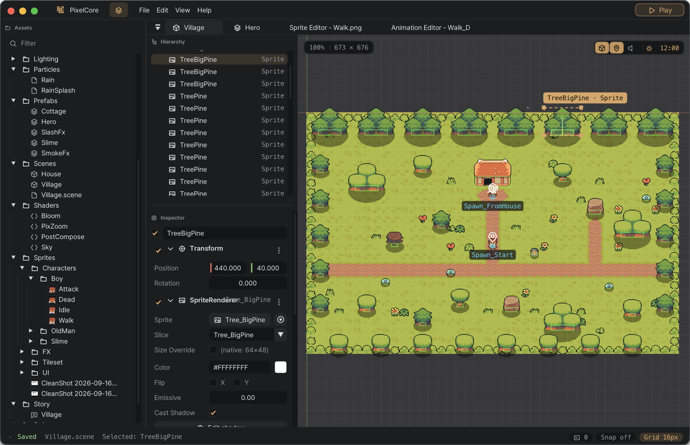
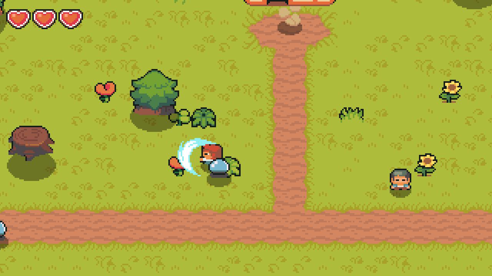
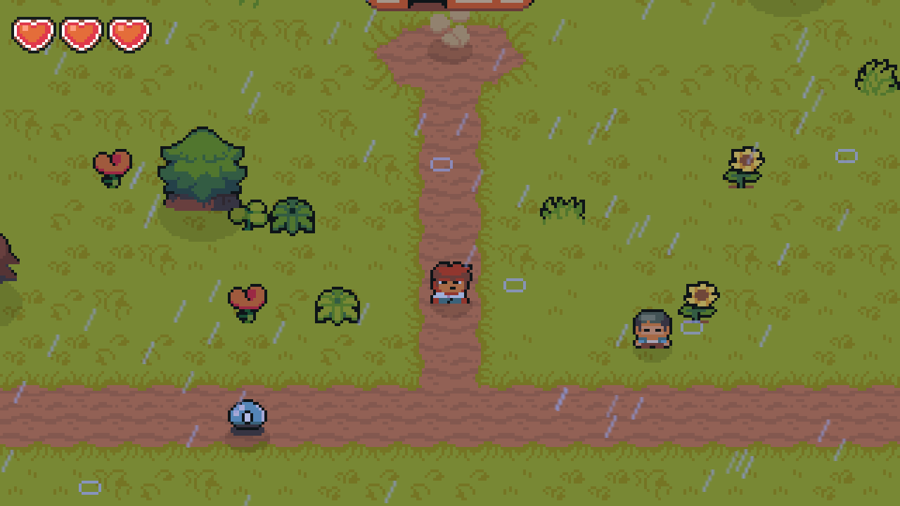
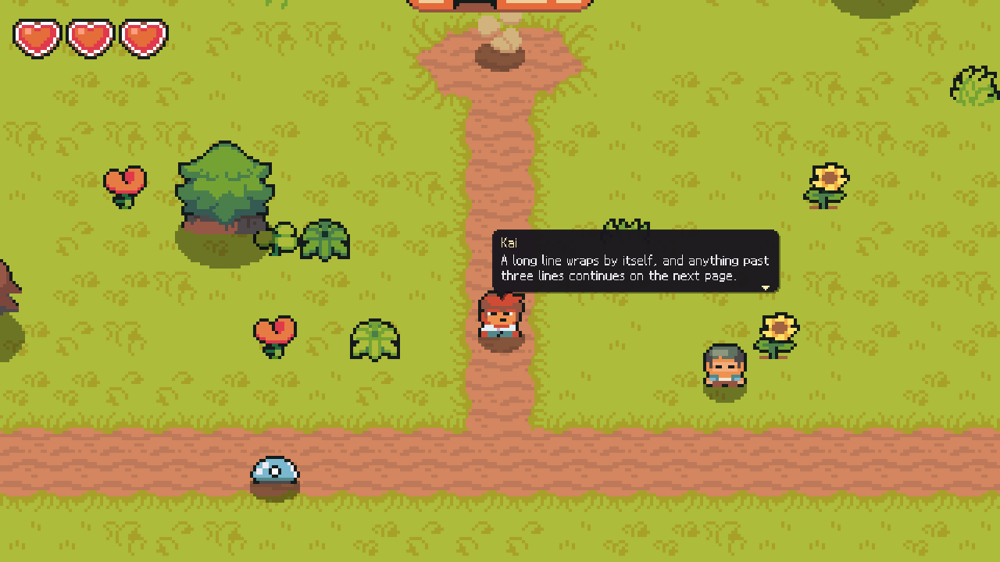
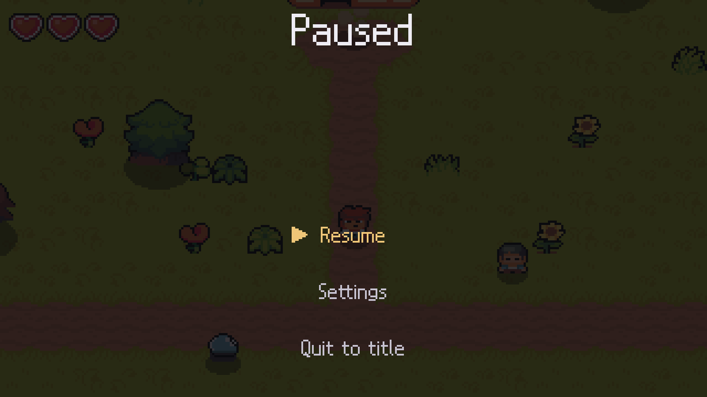
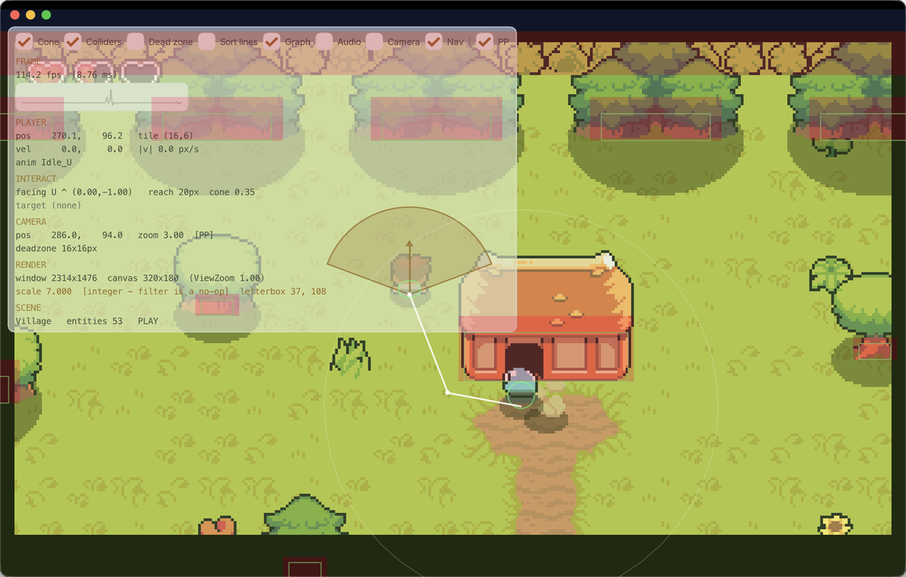
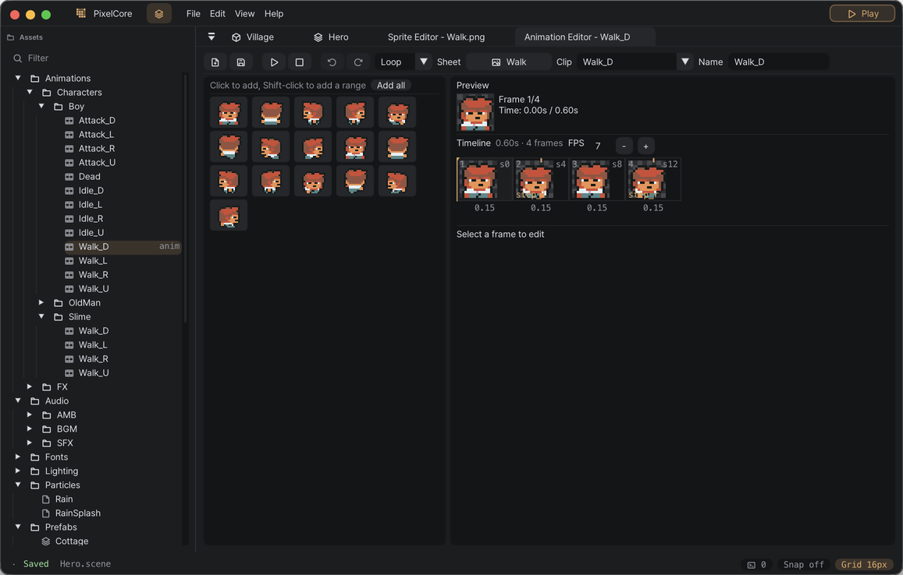

<div align="center">



# PixelCore

**A 2D top-down engine built for pixel art, with its editor running inside the game.**

Dynamic lighting and ground shadows, tilemaps with an autotiling terrain brush, cutscenes written as C#
coroutines, and a small sample game made from a CC0 asset pack — all of it authored in the in-game editor.

[](#)
[](https://fna-xna.github.io/)
[](https://github.com/ocornut/imgui)
[](#)
[](#tests)
[](LICENSE)



</div>

## What it is

PixelCore is a C# engine on top of [FNA](https://fna-xna.github.io/), written for one kind of game: a
top-down pixel-art game where art pixels land on whole screen pixels. The editor is not a separate
program. It is compiled into the debug build and stripped from release builds, so the tools always run
against the code the game runs.

```
Runtime/    ~38k lines   the engine
Editor/     ~24k lines   the in-game editor (compiled out of release builds)
Gameplay/    ~4k lines   the sample game
```

---

## The sample game

A village with a house you can walk into, an old man to talk to, a shrine stone that calls the rain, and
slimes that chase you along paths from the grid pathfinder. Dying fades back to the start of the village.

| | |
|---|---|
|  |  |
|  |  |

Every part of it goes through an engine system: the maps are tilemap layers autotiled by the editor's
terrain brush, the house is a prefab, the dialogue lives in a `.story` file, the rain is a cutscene that
flips the weather — which drives a particle preset, a sound emitter and a lighting profile — and the
hearts, sword and slimes are ordinary components in [`Gameplay/Combat`](Gameplay/Combat).

| Key | Action |
|---|---|
| WASD / arrow keys | Walk |
| E | Talk, examine, open doors, advance dialogue |
| J / Space | Swing the sword |
| Space (hold) | Skip a cutscene |
| Esc | Pause menu |
| F5 | Play inside the editor viewport (editor build) |
| `` ` `` (backtick) | Full game view (editor build) |
| F1 | Debug overlay (editor build) |

---

## Features

### Rendering

- **Pixel-perfect composition** — the world is drawn at 320×180 and scaled up by a whole number. A
  sharp-bilinear shader covers the fractional scales that appear when a window cannot fit an integer one.
- **A sub-pixel camera over a pixel-locked world** — the followed character is drawn in its own pass, so it
  can move at sub-pixel precision while everything else stays on the pixel grid.
- **Y-sorted top-down rendering** — sprites sort by their feet, with sorting groups for props built from
  several sprites, and render layers for floor decals, entities and overlays.
- **Ground shadows** — drawn in their own pass and shaped per sprite, following the sun as the day moves.
- **Post-processing** — LUT colour grading, bloom, vignette, film grain, chromatic aberration, lens
  distortion and fog, stacked as profiles that cutscenes and weather blend between.
- **Procedural sky** — noise baked once at load and drawn behind the world.

### Lighting

- **Four light shapes** — point, cone, rectangle and textured, each with colour, radius, intensity and
  feather.
- **Three passes** — multiply for the lightmap, additive for glow, and negative lights that subtract.
- **Time of day** — a clock drives the ambient colour and the sun direction that shadows follow.
- **Lighting profiles** — a table keyed by scene and tag (`Day`, `Day.Rain`, `Dusk`) that modulates ambient
  colour, light strength, shadow strength and grain, so weather and time change a room without touching
  the scene.

### Simulation

- **Entities own components** — an entity is a transform, a name and a list of component objects, with
  parenting and prefab instances.
- **Axis-separated top-down physics** — box, circle and capsule colliders resolved one axis at a time, with
  corner nudging and steering around round obstacles, so a character slides past a doorway instead of
  sticking to it.
- **Tilemaps** — layers with their own render order and collision, and a terrain autotiler that picks tiles
  from the edge rules in a `.tileset` sidecar.
- **Grid A\*** — baked from exactly what the physics treats as solid, with connected regions so an
  unreachable target is answered without searching. The debug overlay draws the grid and the path each
  chasing enemy is following right now.

  <div align="center">
  
  </div>

- **Camera** — dead zone, room bounds, per-axis damping, and a fixed mode for single-screen rooms.
- **Coroutines, a state machine, a blackboard with flag lifetimes, and time control** — one pause flag and
  one time scale, so slow motion and the cutscene fast-forward come from the same place.

### Content systems

- **Cutscenes are C# coroutines** — awaitable verbs for walking, speaking, facing, camera moves, waits,
  parallel branches and forks, with scoped input freezes:

  ```csharp
  using var _ = c.Freeze();                       // input is released when the scope ends
  yield return hero.Say("The stone is warm. It is humming.");
  yield return c.Shake(0.6f, 0.4f);
  Weather.SetRain(true);
  yield return Wait.Seconds(0.8f);
  ```

  Skipping runs every command at high speed rather than jumping, so the state a cutscene leaves behind is
  the same either way.
- **Dialogue** — a `.story` format with hot reload, inline markup, per-visit variants, choices, and speech
  bubbles anchored to the speaker.
- **Localisation** — label tables and a translation CSV pipeline, with translation numbers stamped onto
  dialogue lines so a changed line never wears an old translation.
- **Saving** — loading is a new game plus a delta: the world is always built through normal initialisation
  and only the differences are applied. Writes are atomic.
- **Audio** — buses with independent volumes, OGG streaming for music, positional emitters, room ambience
  that crossfades across transitions, and footsteps driven by the surface underfoot.
- **Particles** — preset-driven emitters with seeded variation, prewarming, an additive pass, and a choice
  of world or atmosphere layer.

### Editor

- **A docked shell** — asset browser, scene tabs, hierarchy, inspector and a command palette.
- **A scene view with real handles** — gizmos for transforms, colliders, lights, shadow shapes and camera
  framing, all editable by dragging.
- **Undo and redo on every edit**, including whole subtrees.
- **Prefabs with per-field instance overrides** — an instance keeps only what it changed, and the rest
  follows the prefab.
- **Sprite slicer, animation editor and tilemap editor** — layers, stamps, rectangles, fill and the terrain
  brush.
- **Play in the viewport** — enter play mode inside the editor, edit while it runs, and get the scene back
  when play stops.
- **A debug overlay** — colliders, interaction cones, sort lines, the nav grid, live chase paths, camera
  tuning sliders and a frame graph.
- **Crash recovery backups** — unsaved work is written beside the scene and offered back on the next start.

<div align="center">

</div>

### Asset identity

Every reference is a registry id rather than a path, so files and folders can be moved or renamed without
touching a scene. A scan at boot reports anything that moved, went missing, or was never registered.

---

## Building

Requires the .NET 8 SDK. Tested on macOS (Apple silicon).

```bash
git clone --recursive https://github.com/dvhahn/pixelcore-engine.git
cd pixelcore-engine
dotnet run                    # the editor, opening the sample village
```

If the repository was cloned without `--recursive`, run `git submodule update --init --recursive` first.

```bash
dotnet watch run                                  # with C# hot reload
dotnet publish -c Release -r osx-arm64            # release build: NativeAOT, no editor
scripts/package-app.sh                            # wrap the release build as a macOS app
```

Native libraries for macOS are in `fnalibs/osx`. Windows needs the matching FNA native libraries placed in
`fnalibs/win-x64`.

## Tests

The self-tests run headless, with no window and no graphics device.

```bash
PIXELCORE_SELFTEST=1 dotnet run        # 3,343 checks across 44 suites
PIXELCORE_SAVETEST=1 dotnet run        # save and load round trips through real scenes
PIXELCORE_CUTSCENE_ALL=1 dotnet run    # plays every cutscene; the exit code is the number of problems
```

## License

The engine, the editor and the sample game's code are under the [MIT License](LICENSE).

The bundled art, audio and fonts keep their own licenses. Third-party components are listed in
[THIRD_PARTY_NOTICES.md](THIRD_PARTY_NOTICES.md), and the sample game's asset credits are in
[ASSETS.md](ASSETS.md).
